# ppca-fbd
Código da Disciplina Fundamentos de Bancos de Dados

## Introdução

As Cotas para Exercício da Atividade Parlamentos dos Senadores compreendem uma verba para reembolso de gastos dos Senadores em áreas específicas, para facilitar o exercício do mandato. Regulada pelo Ato da Primeira-Secretaria [APS 5/2014](https://adm.senado.leg.br/normas/ui/pub/normaConsultada?2&idNorma=203003), ela permite que os seguintes gastos sejam ressarcidos aos Senadores:

- aluguel e manutenção de imóvel 
- aquisição de material de consumo 
- locação de meios de transporte
- combustíveis e lubrificantes
- contratação de consultorias, assessorias, pesquisas, trabalhos técnicos e outros serviços de apoio ao exercício do mandato parlamentar
- serviços de segurança prestados por empresa especializada;
- divulgação da atividade parlamentar
- passagens aéreas, aquáticas e terrestres nacionais destinadas ao parlamentar ou a servidores comissionados e efetivos

Seu montante varia de Senador para Senador, pois é calculado com uma Verba indenizatória fixa de R$ 15.000,00, somada ao valor de cinco passagens aéreas entre Brasília e a capital do Estado de origem do parlamentar, conforme Tabela IATA de tarifa governamental.e

Para ter o ressarcimento, o parlamentar deve submeter o pedido de reembolso ao Senado, apresentando as notas fiscais dos serviços. Após análise de cada gasto, os valores pertinentes são depositados ao parlamentar, enquanto aqueles que não são permitidos pelo Ato são glosados.

Uma vez que o volume de dinheiro envolvido com essa verba é grande, e as possibilidades de fornecedores envolvidos são indefinidas, assumimos que analisar os dados desses gastos seria um bom escopo para nosso trabalho.

## Modelagem

Para realizar a análise dos dados da CEAPS, foi feita a seguinte modelagem:


Ela consiste em duas tabelas de carga (`CARGA_SENADOR` e `CARGA_DESPESA`), que serão responsáveis por receber as informações brutas que serão montadas com base nos dados do Portal da Transparência do Senado Federal. 

Cada uma dessas tabelas terá uma  _trigger_ , que será responsável por quebrar as informações e normalizá-las no modelo proposto. A lógica da  _trigger_ de Senadores está mostrada abaixo: 

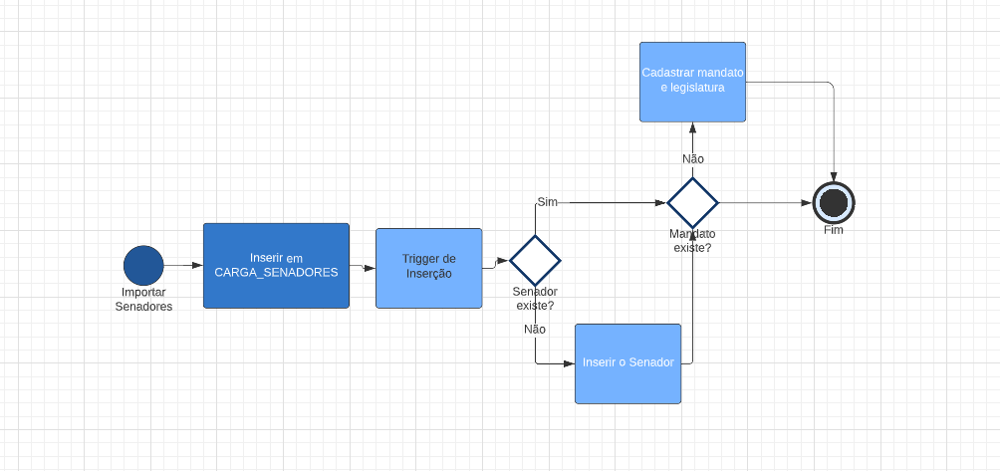

Já a carga de despesas, por ser mais complexa, delega para uma procedure a responsabilidade de colocar as informações nas tabelas, conforme mostra o fluxo:

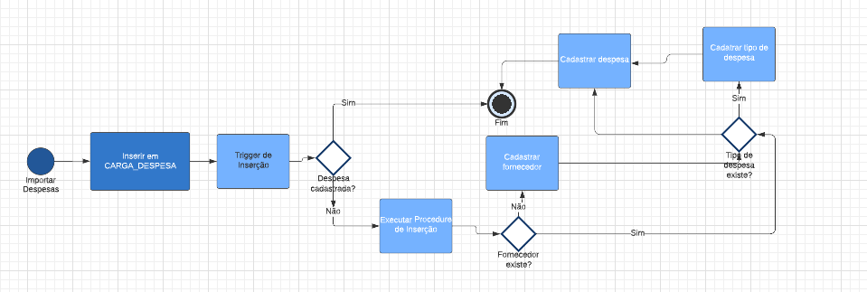

Ao final dessa lógica, teremos as informações segmentadas nas seguintes tabelas:

- `SENADOR`: Apresentará os dados de um Senador, que será referenciado pelas outras tabelas
- `MANDATO`: Um Senador pode ter vários mandatos. Essa informação deve ser normalizada para poder diferenciar em qual mandato o gasto foi realizado
- `LEGISLATURA`: É o período de 4 anos de exercício de um parlamentar. O mandato de um Senador compreende duas legislaturas
- `MANDATO_LEGISLATURA`: Relaciona as informações de mandato e legislatura
- `FORNECEDOR`: Representa o fornecedor de algum serviço que o Senador utilizou. São identificados pelo CPF ou CNPJ
- `TIPO_DESPESA`: Os tipos de despesa que foram ressarcidos
- `DESPESA`: As informações do reembolso que foi realizado 

O script de criação desse modelo pode ser visto abaixo:

```sql
-- Carga despesa
CREATE TABLE fbd.CARGA_DESPESA(
	ANO INT(4) NOT NULL,
	MES INT(2) NOT NULL,
	SENADOR varchar(255) NOT NULL,
	TIPO_DESPESA varchar(255) NULL,
	CNPJ_CPF varchar(20) NULL,
	FORNECEDOR varchar(255) NULL,
	DOCUMENTO varchar(255) NULL,
	DATA_REEMBOLSO DATE NULL,
	DETALHAMENTO varchar(2000) NULL,
	VALOR_REEMBOLSADO decimal(15,2) NULL,
	COD_DOCUMENTO varchar(100) NULL
)
ENGINE=InnoDB
DEFAULT CHARSET=utf8mb4
COLLATE=utf8mb4_0900_ai_ci;

-- Carga Senador
CREATE TABLE fbd.CARGA_SENADOR (
	NOME varchar(255) NULL,
	PARTIDO varchar(100) NULL,
	UF varchar(2) NULL,
	PERIODO varchar(100) NULL,
	SEXO varchar(1) NULL,
	LEGISLATURA smallint NULL
)
ENGINE=InnoDB
DEFAULT CHARSET=utf8mb4
COLLATE=utf8mb4_0900_ai_ci;

-- Tipo Despesa
CREATE TABLE fbd.TIPO_DESPESA (
	ID_TIPO_DESPESA BIGINT auto_increment NOT NULL,
	DESCRICAO varchar(255) NOT NULL,
	CONSTRAINT TIPO_DESPESA_PK PRIMARY KEY (ID_TIPO_DESPESA),
	CONSTRAINT TIPO_DESPESA_UN UNIQUE KEY (DESCRICAO)
)
ENGINE=InnoDB
DEFAULT CHARSET=utf8mb4
COLLATE=utf8mb4_0900_ai_ci
AUTO_INCREMENT=1;

-- Legislatura
CREATE TABLE fbd.LEGISLATURA (
  NR_LEGISLATURA smallint NOT NULL,
  ANO_INICIO smallint NOT NULL,
  ANO_FIM smallint NOT NULL,
  CONSTRAINT LEGISLATURA_PK PRIMARY KEY (NR_LEGISLATURA)
) ENGINE=InnoDB DEFAULT CHARSET=utf8mb4 COLLATE=utf8mb4_0900_ai_ci;

-- Fornecedor
CREATE TABLE fbd.FORNECEDOR (
	ID_FORNECEDOR BIGINT auto_increment NOT NULL,
	NOME varchar(255) NOT NULL,
	CPF_CNPJ varchar(20) NULL,
	CONSTRAINT FORNECEDOR_PK PRIMARY KEY (ID_FORNECEDOR),
	CONSTRAINT FORNECEDOR_UN UNIQUE KEY (CPF_CNPJ)
)
ENGINE=InnoDB
DEFAULT CHARSET=utf8mb4
COLLATE=utf8mb4_0900_ai_ci
AUTO_INCREMENT=1;

-- Senador

CREATE TABLE fbd.SENADOR (
  ID_SENADOR bigint NOT NULL AUTO_INCREMENT,
  NOME varchar(255) NOT NULL,
  SEXO varchar(1) DEFAULT NULL,
  CONSTRAINT SENADOR_PK PRIMARY KEY (ID_SENADOR),
  CONSTRAINT SENADOR_NOME_UN UNIQUE KEY (NOME)
) 
ENGINE=InnoDB 
DEFAULT CHARSET=utf8mb4 
COLLATE=utf8mb4_0900_ai_ci 
AUTO_INCREMENT=1;

-- Mandato

CREATE TABLE fbd.MANDATO (
	ID_MANDATO BIGINT auto_increment NOT NULL,
	ID_SENADOR BIGINT NOT NULL,
	ESTADO varchar(2) NULL,
	PERIODO varchar(100) NULL,
	LEGISLATURA SMALLINT NULL,
	PARTIDO varchar(100) NULL,
	CONSTRAINT MANDATO_PK PRIMARY KEY (ID_MANDATO),
	CONSTRAINT MANDATO_FK FOREIGN KEY (ID_SENADOR) 
	    REFERENCES fbd.SENADOR(ID_SENADOR)
)
ENGINE=InnoDB
DEFAULT CHARSET=utf8mb4
COLLATE=utf8mb4_0900_ai_ci
AUTO_INCREMENT=1;

-- Mandato Legislatura

CREATE TABLE fbd.MANDATO_LEGISLATURA (
	ID_MANDATO BIGINT NOT NULL,
	NR_LEGISLATURA SMALLINT NOT NULL,
	CONSTRAINT MANDATO_LEGISLATURA_PK 
	    PRIMARY KEY (ID_MANDATO,NR_LEGISLATURA),
	CONSTRAINT MANDATO_LEGISLATURA_MANDATO_FK 
	    FOREIGN KEY (ID_MANDATO) REFERENCES fbd.MANDATO(ID_MANDATO),
	CONSTRAINT MANDATO_LEGISLATURA_LEGISLATURA_FK 
	    FOREIGN KEY (NR_LEGISLATURA) REFERENCES fbd.LEGISLATURA(NR_LEGISLATURA)
)
ENGINE=InnoDB
DEFAULT CHARSET=utf8mb4
COLLATE=utf8mb4_0900_ai_ci;

-- Despesa

CREATE TABLE fbd.DESPESA (
	ID_DESPESA BIGINT auto_increment NOT NULL,
	ANO SMALLINT NOT NULL,
	MES TINYINT NOT NULL,
	ID_SENADOR BIGINT NOT NULL,
	ID_FORNECEDOR BIGINT NULL,
	ID_TIPO_DESPESA BIGINT NOT NULL,
	DATA_REEMBOLSO DATE NULL,
	DETALHAMENTO varchar(2000) NULL,
	DOCUMENTO varchar(100) NULL,
	COD_DOCUMENTO varchar(100) NOT NULL,
	VALOR_REEMBOLSADO decimal(15,2) NOT NULL,
	CONSTRAINT DESPESA_PK PRIMARY KEY (ID_DESPESA),
	CONSTRAINT DESPESA_SENADOR_FK FOREIGN KEY (ID_SENADOR) 
	    REFERENCES fbd.SENADOR(ID_SENADOR),
	CONSTRAINT DESPESA_FORNECEDOR_FK FOREIGN KEY (ID_FORNECEDOR) 
	    REFERENCES fbd.FORNECEDOR(ID_FORNECEDOR),
	CONSTRAINT DESPESA_TIPO_DESPESA_FK FOREIGN KEY (ID_TIPO_DESPESA) 
	    REFERENCES fbd.TIPO_DESPESA(ID_TIPO_DESPESA),
	CONSTRAINT DESPESA_CODIGO_UN UNIQUE KEY (COD_DOCUMENTO)
)
ENGINE=InnoDB
DEFAULT CHARSET=utf8mb4
COLLATE=utf8mb4_0900_ai_ci
AUTO_INCREMENT=1;

-- Carga da tabela Legislatura

INSERT INTO fbd.LEGISLATURA (NR_LEGISLATURA,ANO_INICIO,ANO_FIM) VALUES (53,2007,2011);
INSERT INTO fbd.LEGISLATURA (NR_LEGISLATURA,ANO_INICIO,ANO_FIM) VALUES (54,2011,2015);
INSERT INTO fbd.LEGISLATURA (NR_LEGISLATURA,ANO_INICIO,ANO_FIM) VALUES (55,2015,2019);
INSERT INTO fbd.LEGISLATURA (NR_LEGISLATURA,ANO_INICIO,ANO_FIM) VALUES (56,2019,2023);

-- Trigger de carga de senadores

delimiter $$
CREATE DEFINER=`root`@`%` TRIGGER TRG_CARGA_SENADOR
AFTER INSERT
ON CARGA_SENADOR FOR EACH row
begin
    DECLARE v_id_senador int default 0;
    DECLARE v_id_mandato int default 0;
   
	SELECT s.id_senador INTO v_id_senador 
	    FROM fbd.SENADOR s WHERE TRIM(UPPER(s.nome)) = TRIM(UPPER(new.NOME)) 
	    COLLATE utf8mb4_0900_ai_ci;    
	
	IF (v_id_senador = 0) then
	    INSERT INTO fbd.SENADOR (NOME, SEXO) 
	        VALUES (UPPER(new.NOME), new.SEXO);
	    SELECT s.id_senador INTO v_id_senador 
	        FROM fbd.SENADOR s WHERE TRIM(UPPER(s.nome)) = TRIM(UPPER(new.NOME)) 
		COLLATE utf8mb4_0900_ai_ci;
	end if; 
   
	SELECT m.id_mandato INTO v_id_mandato 
	    FROM fbd.MANDATO m 
	    WHERE m.ID_SENADOR = v_id_senador AND m.LEGISLATURA = new.legislatura;
 	
   IF (v_id_mandato = 0) then
    	INSERT INTO MANDATO (ID_SENADOR, ESTADO, PERIODO, LEGISLATURA, PARTIDO) 
	    VALUES (V_ID_SENADOR, new.uf, new.PERIODO, new.LEGISLATURA, new.PARTIDO);
    	SELECT m.id_mandato INTO v_id_mandato 
	    FROM fbd.MANDATO m 
	    WHERE m.ID_SENADOR = v_id_senador AND m.LEGISLATURA = new.legislatura;
        INSERT INTO MANDATO_LEGISLATURA (ID_MANDATO, NR_LEGISLATURA) 
	    VALUES (v_id_mandato, new.LEGISLATURA);
    end if;

 END 
$$
 
 -- Procedure de carga de despesa
CREATE DEFINER=`root`@`%` PROCEDURE `fbd`.`PRC_ETL_DESPESA`()
BEGIN

	DECLARE v_ano int DEFAULT 0;
    DECLARE v_mes int DEFAULT 0;
    DECLARE v_senador varchar(255) DEFAULT '';
    DECLARE v_tipoDespesa varchar(255) DEFAULT '';
    DECLARE v_cnpjCpf VARCHAR(20) DEFAULT '';
	DECLARE v_fornecedor varchar(255) DEFAULT '';
	DECLARE v_documento varchar(255) DEFAULT '';
	DECLARE v_dataReembolso DATE ;
	DECLARE v_detalhamento varchar(2000) DEFAULT '';
	DECLARE v_valorReembolsado decimal(15,2) ;
	DECLARE v_codDocumento varchar(100) ;
	DECLARE idSenador bigint DEFAULT 0;
	DECLARE idFornecedor bigint DEFAULT NULL;
	DECLARE idTipoDespesa bigint DEFAULT NULL;
	DECLARE cpfCnpjLimpo varchar(20) DEFAULT '';
    DECLARE total INT DEFAULT 0;
    DECLARE done BOOLEAN DEFAULT false;
    DECLARE curs CURSOR FOR 
    	SELECT ANO, MES, SENADOR, TIPO_DESPESA, CNPJ_CPF, FORNECEDOR, DOCUMENTO, 
	    DATA_REEMBOLSO, DETALHAMENTO, VALOR_REEMBOLSADO, COD_DOCUMENTO 
    	FROM CARGA_DESPESA 
    	WHERE COD_DOCUMENTO NOT IN (
    		SELECT COD_DOCUMENTO COLLATE utf8mb4_0900_as_ci AS COD 
		    FROM DESPESA
    	) AND SENADOR IN (
    		SELECT DISTINCT s.NOME COLLATE utf8mb4_0900_as_ci AS NOME_SENADOR 
		    FROM SENADOR s);
    DECLARE CONTINUE HANDLER FOR NOT FOUND SET done = TRUE;
   	
    SELECT CONCAT('TOTAL DE REGISTROS: ',FOUND_ROWS()); 
	SELECT 'Iniciando cadastro...';
    OPEN curs;
   
	read_loop: LOOP
    -- WHILE (done != true)DO
    	SET done = false;
        FETCH curs INTO v_ano, v_mes, v_senador, v_tipoDespesa, 
	    v_cnpjCpf, v_fornecedor, 
	    v_documento, v_dataReembolso, v_detalhamento, 
	    v_valorReembolsado, v_codDocumento;
        IF done THEN
        	LEAVE read_loop;
        END IF;
       -- Verifica se o Senador já está na base, para recuperar o ID dele
       	-- SELECT CONCAT('Pesquisando o Senador ', v_senador); 
		SELECT ID_SENADOR INTO idSenador FROM SENADOR 
		    WHERE UPPER(NOME) = UPPER(v_senador) COLLATE utf8mb4_0900_as_ci;
		-- SELECT concat('Recuperou o senador com id ', idSenador);
		IF (idSenador IS NOT NULL AND idSenador > 0) THEN
			START TRANSACTION;
		
			-- Verifica se foi informado um fornecedor
			IF (v_cnpjCpf IS NOT NULL AND TRIM(v_cnpjCpf) <> '') THEN
			-- Verifica se o fornecedor já está na base. Se não estiver,
			-- insere
			SET cpfCnpjLimpo = 
			  TRIM(REPLACE(REPLACE(REPLACE
			    (v_cnpjCPf, '.', ''),'-',''),'/',''));
			-- SELECT CONCAT('Verificando fornecedor com cpfCnpj ', 
			--   cpfCnpjLimpo);
			SELECT ID_FORNECEDOR INTO idFornecedor FROM FORNECEDOR 
			    WHERE TRIM(CPF_CNPJ) = cpfCnpjLimpo 
			    COLLATE utf8mb4_0900_as_ci;
			-- SELECT CONCAT('Fornecedor: ', idFornecedor);
			IF (idFornecedor IS NULL) THEN
				INSERT INTO FORNECEDOR (NOME, CPF_CNPJ) 
				VALUES (v_fornecedor, cpfCnpjLimpo);
				SET idFornecedor = LAST_INSERT_ID();
				-- SELECT CONCAT('Fornecedor ', v_fornecedor, 
				--' inserido com id ', idFornecedor);
			END IF;
			
			END IF;
		
			-- Verifica se o tipo de despesa já está na base
			-- SELECT CONCAT('Verificando tipo de despesa', 
			-- v_tipoDespesa);
			SELECT ID_TIPO_DESPESA INTO idTipoDespesa 
			    FROM TIPO_DESPESA 
			    WHERE TRIM(UPPER(DESCRICAO)) = 
			        TRIM(UPPER(v_tipoDespesa)) 
			    COLLATE utf8mb4_0900_as_ci;
			-- SELECT CONCAT('Tipo de despesa: ', idFornecedor);
			IF (idTipoDespesa IS NULL) THEN
				INSERT INTO TIPO_DESPESA (DESCRICAO) 
				VALUES (v_tipoDespesa);
				SET idTipoDespesa = LAST_INSERT_ID(); 
				-- SELECT CONCAT('Tipo de despesa ', 
				-- v_tipoDespesa, ' inserido com id ', 
				-- idTipoDespesa);
			END IF;
			
			-- SELECT CONCAT ('Ano: ', v_ano);
			-- Insere os dados na tabela DESPESA
			INSERT INTO DESPESA (ANO, MES, ID_SENADOR, ID_FORNECEDOR, 
			    ID_TIPO_DESPESA, 
			    DATA_REEMBOLSO, DETALHAMENTO , DOCUMENTO, COD_DOCUMENTO, 
			    VALOR_REEMBOLSADO)
			    VALUES (v_ano, v_mes, idSenador, idFornecedor, 
			    idTipoDespesa, v_dataReembolso, 
			    v_detalhamento ,v_documento, v_codDocumento, 
			    v_valorReembolsado);
			-- Limpa as variáveis para garantir que a verificação 
			-- será feita corretamente
			SET idFornecedor = NULL;
			SET idTipoDespesa = NULL;
			SET total = total +1;
			
			
			COMMIT;
        END IF;
       	-- Limpa o senador para garantir outro loop
       	SET idSenador = NULL;

	END LOOP;
    CLOSE curs;
    SELECT CONCAT('Importação terminada! ', total, ' registros importados!'); 
   

END  $$

CREATE DEFINER=`root`@`%` TRIGGER `TRG_CARGA_DESPESA` 
AFTER INSERT ON `CARGA_DESPESA` 
FOR EACH ROW begin
    DECLARE v_id_despesa int default 0;
   
	SELECT d.ID_DESPESA INTO v_id_despesa FROM fbd.DESPESA d 
	    WHERE d.COD_DOCUMENTO = new.COD_DOCUMENTO;    
	
	IF (v_id_despesa = 0) then
		CALL fbd.PRC_INCLUSAO_DESPESA (new.ANO, new.MES, new.SENADOR, 
		    new.TIPO_DESPESA, 
		    new.CNPJ_CPF, 
		    new.FORNECEDOR, new.DOCUMENTO, new.DATA_REEMBOLSO, 
		    new.DETALHAMENTO, 
		    new.VALOR_REEMBOLSADO, 
		    new.COD_DOCUMENTO);
	end if; 
   
 END $$
 
CREATE DEFINER=`root`@`%` PROCEDURE fbd.PRC_INCLUSAO_DESPESA(
    IN v_ano int,
	IN v_mes int,
    IN v_senador varchar(255) ,
    IN v_tipoDespesa varchar(255) ,
    IN v_cnpjCpf VARCHAR(20) ,
	IN v_fornecedor varchar(255) ,
	IN v_documento varchar(255) ,
	IN v_dataReembolso DATE ,
	IN v_detalhamento varchar(2000) ,
	IN v_valorReembolsado decimal(15,2) ,
	IN v_codDocumento varchar(100) 

)
BEGIN
	DECLARE idSenador bigint DEFAULT 0;
	DECLARE idFornecedor bigint DEFAULT NULL;
	DECLARE idTipoDespesa bigint DEFAULT NULL;
	DECLARE cpfCnpjLimpo varchar(20) DEFAULT '';
    DECLARE total INT DEFAULT 0;

   -- Verifica se o Senador já está na base, para recuperar o ID dele
   	-- SELECT CONCAT('Pesquisando o Senador ', v_senador); 
	SELECT ID_SENADOR INTO idSenador FROM SENADOR 
	    WHERE UPPER(NOME) = UPPER(v_senador) COLLATE utf8mb4_0900_as_ci;
	-- SELECT concat('Recuperou o senador com id ', idSenador);
	IF (idSenador IS NOT NULL AND idSenador > 0) THEN
		START TRANSACTION;
	
		-- Verifica se foi informado um fornecedor
		IF (v_cnpjCpf IS NOT NULL AND TRIM(v_cnpjCpf) <> '') THEN
		-- Verifica se o fornecedor já está na base. Se não estiver, 
		-- insere
			SET cpfCnpjLimpo = 
			  TRIM(REPLACE(REPLACE(REPLACE(
			    v_cnpjCPf, '.', ''),'-',''),'/',''));
			-- SELECT CONCAT('Verificando fornecedor com cpfCnpj ', 
			--   cpfCnpjLimpo);
			SELECT ID_FORNECEDOR INTO idFornecedor FROM FORNECEDOR 
			    WHERE TRIM(CPF_CNPJ) = cpfCnpjLimpo 
			    COLLATE utf8mb4_0900_as_ci;
			-- SELECT CONCAT('Fornecedor: ', idFornecedor);
			IF (idFornecedor IS NULL) THEN
				INSERT INTO FORNECEDOR (NOME, CPF_CNPJ) 
				    VALUES (v_fornecedor, cpfCnpjLimpo);
				SET idFornecedor = LAST_INSERT_ID();
				-- SELECT CONCAT('Fornecedor ', v_fornecedor,
				--' inserido com id ', idFornecedor);
			END IF;
		END IF;
	
		-- Verifica se o tipo de despesa já está na base
		-- SELECT CONCAT('Verificando tipo de despesa', v_tipoDespesa);
		SELECT ID_TIPO_DESPESA INTO idTipoDespesa FROM TIPO_DESPESA 
		    WHERE TRIM(UPPER(DESCRICAO)) = TRIM(UPPER(v_tipoDespesa)) 
		    COLLATE utf8mb4_0900_as_ci;
		-- SELECT CONCAT('Tipo de despesa: ', idFornecedor);
		IF (idTipoDespesa IS NULL) THEN
			INSERT INTO TIPO_DESPESA (DESCRICAO) VALUES 
			    (v_tipoDespesa);
			SET idTipoDespesa = LAST_INSERT_ID(); 
			-- SELECT CONCAT('Tipo de despesa ', v_tipoDespesa, 
			-- ' inserido com id ', idTipoDespesa);
		END IF;
		
		-- SELECT CONCAT ('Ano: ', v_ano);
		-- Insere os dados na tabela DESPESA
		INSERT INTO DESPESA (ANO, MES, ID_SENADOR, 
		    ID_FORNECEDOR, ID_TIPO_DESPESA, 
		    DATA_REEMBOLSO, DETALHAMENTO , DOCUMENTO, 
		    COD_DOCUMENTO, VALOR_REEMBOLSADO)
		    VALUES (v_ano, v_mes, idSenador, idFornecedor, idTipoDespesa, 
		    v_dataReembolso, v_detalhamento ,
		    v_documento, v_codDocumento, v_valorReembolsado);
		
		
		COMMIT;
    END IF;
END $$

create view fbd.VW_DESPESA_POR_LEGISLATURA AS
select tp.DESCRICAO as DESCRICAO_DESPESA, sum(d.VALOR_REEMBOLSADO) as VALOR_TOTAL, 
    concat(l.ANO_INICIO, " - ", l.ANO_FIM) as LEGISLATURA  
from fbd.TIPO_DESPESA tp, fbd.DESPESA d, fbd.SENADOR s, 
     fbd.FORNECEDOR f, fbd.MANDATO m, fbd.LEGISLATURA l, 
     fbd.MANDATO_LEGISLATURA ml  
where tp.ID_TIPO_DESPESA = d.ID_TIPO_DESPESA and 
      d.ID_SENADOR = s.ID_SENADOR and 
      d.ID_FORNECEDOR = f.ID_FORNECEDOR and 
      s.ID_SENADOR = m.ID_SENADOR and 
      m.ID_MANDATO = ml.ID_MANDATO and 
      m.LEGISLATURA = ml.NR_LEGISLATURA and 
      ml.NR_LEGISLATURA = l.NR_LEGISLATURA and 
      (d.ANO between l.ANO_INICIO and l.ANO_FIM)
group by tp.ID_TIPO_DESPESA, l.NR_LEGISLATURA ;

$$

delimiter ;

```

## Arquitetura da solução

O SGBD escolhido para realizar a importação dos dados foi o MySQL. A maneira mais simples de subir essa infraestrutura foi a utilização de uma imagem Docker, que cria um container com a configuração do MySQL pronta para ser usada. Porém, a instalação direta do MySQL também deve funcionar.


Após isso, foi feita a montagem dos dados dos Senadores e das Cotas Parlamentares. Os dados abertos das Cotas estão em [https://www12.senado.leg.br/transparencia/dados-abertos-transparencia/dados-abertos-ceaps](https://www12.senado.leg.br/transparencia/dados-abertos-transparencia/dados-abertos-ceaps) , item Cotas para Exercício da Atividade Parlamentar dos Senadores (CEAPS). 

Para os dados dos Senadores, houve uma diferença: o portal do Senado não possui um arquivo pronto com os dados dos parlamentares das legislaturas anteriores. Sendo assim, foi necessário recuperar esses dados através das informações que estão nas páginas HTML e formatá-los como CSVs para importação no banco.

Foi utilizada como ferramenta de interação com o banco de dados o [DBeaver](https://dbeaver.io/download/), uma solução de software livre que permite fazer as consultas e importações de dados para nosso trabalho.

Todo o código do trabalho está disponível no endereço [https://github.com/demetriusjube/ppca-fbd](https://github.com/demetriusjube/ppca-fbd), e pode ser baixado para replicação.

## Montagem do ambiente

Os seguintes passos devem ser feitos para montagem do ambiente:

- Instale o Docker com o Docker Compose(https://docs.docker.com/compose/install/)
- Rode o seguinte comando no local onde está o arquivo docker-compose.yml para subir o banco de dados: `docker-compose up`. Ele vai criar um banco de dados com as seguintes características:
 - Server host: localhost
 - Port: 3306
 - Database: fbd
 - Username: root
 - Password: fbd
- Instale o DBeaver (https://dbeaver.io/download/)

### Configuração do DBeaver

Pra acessar com mais facilidade o banco de dados e permitir uma importação com facilidade, é necessário configurar uma conexão com o DBeaver. Ela será feita conforme o roteiro abaixo:

1. Na aba Navegador de Banco de Dados, clique com o botão direito e selecione Criar -> Connection:


2. Selecione, na lista de SGBDs, o driver do MySQL. Se ele não estiver na máquina, ele vai baixar:


3. Configure a conexão com as credenciais do banco criado pelo Docker (se usar uma instalação própria, use as credenciais definidas lá):


4. Modifique a conexão para que a opção Allow Public Key seja setada para `true`. Isso evita o erro de conexão que acontece quando o MySQL tenta recuperar uma chave pública para a conexão:


5. Salve a conexão. 

## Processo de ETL

Para dar a carga dos dados recuperados do site da Transparência no nosso banco de dados, precisaremos fazer a preparação dos dados dos arquivos e a importação no SGBD. Veremos todos os passos a seguir.

### Criação das tabelas do banco de dados

Vamos criar os objetos de banco necessários para que possamos receber os dados e tratá-los para obter as informações que queremos. O script de criação dos dados está em `fbd_scripts/fbd_script-total.sql`, e vai gerar o banco de dados que definimos na modelagem.

Para rodar o script, faça o seguinte roteiro:

- No DBeaver, clique com o botão direito em cima do banco `fbd` e abra um Editor SQL:


- Rode o script mencionado acima. Ele criará toda a estrutura apresentada no modelo.

Além de criar a estrutura de tabelas, o script também carrega a tabela  _Legislatura_ , que já tem valores conhecidos para o nosso problema.

### Dados dos Senadores

#### Tratamento dos arquivos

- Entre no endereço que contém as [legislaturas](https://www25.senado.leg.br/web/senadores/legislaturas-anteriores) do Senado Federal
- Escolha a legislatura que será importada. No caso em tela, faremos isso para as legislaturas de 53 a 55
- Em  _Organizar por_ , selecione a opção  _Sexo_ 
- Selecione os nomes na tela e copie as informações
- Abra um editor de planilhas da sua preferência e cole as informações nele
- Acrescente duas colunas à direita dos dados: `Sexo` e `Legislatura`
- Preencha o valor da coluna `Sexo` de acordo com o o grupo
- Preencha o valor da coluna `Legislatura` com o número da legislatura pesquisada
- Apague as linhas que contém os valores Masculino e Feminino
- Repita o procedimento para cada legislatura
- Ao terminar de importar os dados das legislaturas anteriores, vá até o endereço da (legislatura atual)[https://www25.senado.leg.br/web/senadores/em-exercicio/-/e/por-sexo]
- Faça o mesmo tratamento que foi feito para as legislaturas anteriores
- Retire os caracteres `"  *"` (dois espaços em branco e um asterisco) da massa de dados. Esse sinal gráfico é pra representar os suplentes que entraram em exercício, e podem impedir que os senadores sejam identificados corretamente.
- Salve o arquivo CSV 

#### Importação dos dados para o SGBD

- No Navegador de banco de dados, clique com o botão direito na tabela CARGA_SENADOR, e selecione Importar dados


- Escolha a fonte de dados (CSV)


- O programa vai abrir uma janela para a escolha do arquivo. Selecione o arquivo que deseja importar:


- Informe as propriedades da importação:


Note que as seguintes propriedades são específicas para o nosso caso:
  * Encoding (Traduzido de forma errada para Encodificando): ISO-8859-1
  * Delimitador de coluna: `;`. Os dados não são separados por vírgula na fonte, e sim, por ponto-e-vírgula
  * Definir Strings vazias para NULL: `true`. Dessa forma as colunas ficarão nulas, e não com string vazias
  * Formato Date/Time: `dd/MM/yyyy`, para que as datas sejam importadas no formato correto

- Mapeie as colunas do CSV com as colunas da tabela. 


- Avance no Wizard até o resumo, e confira as especificações que foram definidas:


- Conclua o procedimento, e os dados serão carregados na tabela CARGA_SENADOR

A cada `INSERT`, os dados serão lançados nas tabelas normalizadas que tratam as informações do Senadores.


### Dados brutos de despesa

#### Tratamento dos arquivos

- Baixar os dados do [site](https://www12.senado.leg.br/transparencia/dados-abertos-transparencia/dados-abertos-ceaps). Utilizaremos o período de 2009 a 2020, por estarem mais completos e íntegros
- Abra os arquivos `csv` e retire a primeira linha. Ela tem o seguinte formato: `"ULTIMA ATUALIZACAO";"06/08/2021 02:00"`

#### Importação dos dados para o SGBD

Assim como foi feito para os dados dos Senadores, os dados de despesas também devem ser importados utilizando o DBeaver. Repita os passos que foram feitos para a tabela `CARGA_SENADOR`, tendo o cuidado de mapear as colunas do CSV corretamente. Atenção para a coluna `DATA`, que deve ser mapeada para `DATA_REEMBOLSO`.

Cada inserção na tabela fará a chamada para a  _trigger_, que invocará a  _procedure_ `PRC_INCLUSAO_DESPESA` para quebrar essas informações.

## Manipulação dos dados

### PROCEDURE `PRC_INCLUSAO_DESPESA`

Essa procedure é a responsável por gravar os dados das despesas em suas tabelas normalizadas, como foi visto anteriormente. O código contendo sua lógica pode ser visto abaixo:

```sql
CREATE DEFINER=`root`@`%` PROCEDURE fbd.PRC_INCLUSAO_DESPESA(
    IN v_ano int,
	IN v_mes int,
    IN v_senador varchar(255) ,
    IN v_tipoDespesa varchar(255) ,
    IN v_cnpjCpf VARCHAR(20) ,
	IN v_fornecedor varchar(255) ,
	IN v_documento varchar(255) ,
	IN v_dataReembolso DATE ,
	IN v_detalhamento varchar(2000) ,
	IN v_valorReembolsado decimal(15,2) ,
	IN v_codDocumento varchar(100) 

)
BEGIN
	DECLARE idSenador bigint DEFAULT 0;
	DECLARE idFornecedor bigint DEFAULT NULL;
	DECLARE idTipoDespesa bigint DEFAULT NULL;
	DECLARE cpfCnpjLimpo varchar(20) DEFAULT '';
   DECLARE total INT DEFAULT 0;

   -- Verifica se o Senador já está na base, para recuperar o ID dele
	SELECT ID_SENADOR INTO idSenador FROM SENADOR 
	    WHERE UPPER(NOME) = UPPER(v_senador) COLLATE utf8mb4_0900_as_ci;
	-- Se conseguiu recuperar um Senador da base, procede com o cadastro
	IF (idSenador IS NOT NULL AND idSenador > 0) THEN
		-- Inicia uma transação para garantir a consistência dos dados
		START TRANSACTION;
	
		-- Verifica se foi informado um fornecedor
		IF (v_cnpjCpf IS NOT NULL AND TRIM(v_cnpjCpf) <> '') THEN
		-- Verifica se o fornecedor já está na base. 
		-- Se não estiver, insere
			SET cpfCnpjLimpo = 
			  TRIM(REPLACE(REPLACE(REPLACE(
			    v_cnpjCPf, '.', ''),'-',''),'/',''));
			SELECT ID_FORNECEDOR INTO idFornecedor FROM FORNECEDOR 
			    WHERE TRIM(CPF_CNPJ) = cpfCnpjLimpo 
			    COLLATE utf8mb4_0900_as_ci;
			IF (idFornecedor IS NULL) THEN
				INSERT INTO FORNECEDOR (NOME, CPF_CNPJ) 
				    VALUES (v_fornecedor, cpfCnpjLimpo);
				SET idFornecedor = LAST_INSERT_ID();
			END IF;
		END IF;
	
		-- Verifica se o tipo de despesa já está na base
		SELECT ID_TIPO_DESPESA INTO idTipoDespesa FROM TIPO_DESPESA 
		    WHERE TRIM(UPPER(DESCRICAO)) = TRIM(UPPER(v_tipoDespesa)) 
		    COLLATE utf8mb4_0900_as_ci;
		IF (idTipoDespesa IS NULL) THEN
			INSERT INTO TIPO_DESPESA (DESCRICAO) 
			    VALUES (v_tipoDespesa);
			SET idTipoDespesa = LAST_INSERT_ID(); 
		END IF;
		
		-- Insere os dados na tabela DESPESA
		INSERT INTO DESPESA (ANO, MES, ID_SENADOR, 
		    ID_FORNECEDOR, ID_TIPO_DESPESA, 
		    DATA_REEMBOLSO, DETALHAMENTO , DOCUMENTO, 
		    COD_DOCUMENTO, VALOR_REEMBOLSADO)
		VALUES (v_ano, v_mes, idSenador, idFornecedor, 
		    idTipoDespesa, v_dataReembolso, 
		    v_detalhamento ,v_documento, v_codDocumento, 
		    v_valorReembolsado);
		
		
		COMMIT;
    END IF;
END
```

### TRIGGER TRG_CARGA_SENADOR

Uma "trigger" é um objeto de banco de dados ativado quando ocorre algum evento em determinada tabela. Esse eventos podem ser operações como "inserts", "updats" ou "deletes" na tabela em que a "trigger" está vinculada. É possível ativar a trigger tanto antes da operação ocorrer como depois. 

As triggers requerem tabelas físicas para serem ativadas. Triggers não são permitidas em tabelas virtuais como views. Apesar disso, é possível que a trigger seja ativada, se a view for atualizável, no momento em que a a tabela física que esteja associadas à consulta da view for atualizada. Além disso, triggers são ativadas apenas por comandos SQL. Não é possível ativar a trigger com uso de APIs relacionadas à bancos de dados distribuídos. Triggers também não podem ser usadas em tabelas de sistema, como os esquemas "INFORMATION_SCHEMA" e "performance_schema".  

As triggers conseguem disponibilizar os dados do registro, tanto o dado antigo a ser atualizado quanto o dado do novo registro. A trigger oferece a opção "old" para acessar o dado antigo do registro, e a opção "new" para o dado novo. Para usar, basta associar a opção ao campo, no formato old.campo ou new.campo.

Triggers podem ser usadas para validar campos, calcular informações, gravar registros de auditorias, entre outros vários usos. A trigger deste trabalho foi utilizada para realizar o tratamento dos dados recebidos pela carga de senadores provenientes do arquivo CSV. Como visto na etapa de ETL, os dados obtidos da página de dados abertos foram inseridos em "carga_senador". A cada registro inserido, após a inserção, a trigger TRG_CARGA_SENADOR, vinculada a essa tabela, é ativada. 

A tabela "carga_senador" pode ser vista abaixo:


A trigger segue a seguinte lógica: 

- Primero, ela verifica se já existe um senador, na tabela "senador", com aquele nome recebido do CSV, e armazena o identificador em uma variável;
- Caso o senador não exista, ele é inserido na tabela "senador" e depois é feito um "select" para manter o identificador em uma variável;
- Em seguida, é verificado se o mandato recebido pelo CSV existe para aquele servidor. O mandato é mantido por legislatura, então, para cada senador, haverá um registro na tabela mandato vinculado a duas legislaturas;
- É realizada uma operação para selecionar e identificar o identificador do mandato em uma variável;
- Para cada mandato inserido, é necessário fazer o vínculo dele com a legislatura na tabela "MANDATO_LEGISLATURA". Um novo registro é inserido nessa tabela para manter essa informação.

O código da trigger TRG_CARGA_SENADOR é disponibilizado abaixo:

```sql
/* Comando para criar a trigger */
CREATE DEFINER=`root`@`localhost` TRIGGER TRG_CARGA_SENADOR
/* Trigger ativada após insert */
AFTER INSERT
ON carga_senador FOR EACH row
begin
    /* Variáveis para manter informações temporárias. */
    DECLARE v_id_senador int default 0;
    DECLARE v_id_mandato int default 0;
   
    /* Consulta para verificar se o senador já existe na base. */
    SELECT s.id_senador INTO v_id_senador 
        FROM fbd.senador s 
        WHERE TRIM(UPPER(s.nome)) = TRIM(UPPER(new.NOME)) 
	COLLATE utf8mb4_0900_ai_ci;    
    
    IF (v_id_senador = 0) then
        /* Insere valor do senador na base e armazena ID */ 
	INSERT INTO SENADOR (NOME, SEXO) 
	    VALUES (new.NOME, new.SEXO);
	SELECT s.id_senador INTO v_id_senador 
	    FROM fbd.senador s 
	    WHERE TRIM(UPPER(s.nome)) = TRIM(UPPER(new.NOME)) 
	    COLLATE utf8mb4_0900_ai_ci;
    end if; 
   /* Consulta para verificar se mandato já existe. 
       Insere na base e armazena seu ID. */
    SELECT m.id_mandato INTO v_id_mandato 
        FROM fbd.mandato m 
	WHERE m.ID_SENADOR = v_id_senador AND 
	m.LEGISLATURA = new.legislatura;
 	
    IF (v_id_mandato = 0) then
    	INSERT INTO MANDATO (ID_SENADOR, ESTADO, 
	    PERIODO, LEGISLATURA, PARTIDO) 
	    VALUES (V_ID_SENADOR, new.uf, new.PERIODO, 
	        new.LEGISLATURA, new.PARTIDO);
    	SELECT m.id_mandato INTO v_id_mandato 
	    FROM fbd.mandato m 
	    WHERE m.ID_SENADOR = v_id_senador AND 
	        m.LEGISLATURA = new.legislatura;
        INSERT INTO MANDATO_LEGISLATURA (ID_MANDATO, NR_LEGISLATURA) 
	    VALUES (v_id_mandato, new.LEGISLATURA);
    end if;
    
 END 
```

Após o tratamento dos dados realizados pela trigger, pode-se verificar o resultado nas tabelas "senador", "mandato" e "mandato_legislatura", conforme abaixo.

- Tabela senador:


- Tabela mandato:


- Tabela mandato_legislatura:


### VIEW VW_DESPESA_POR_LEGISLATURA

Um requisito do projeto de banco de dados era a criação de uma view. As views são consultas armazenadas que funcionam como uma tabela virtual. Os dados, de fato, não estão presentes na view, mas sim em suas tabelas de origem. A view, assim, é uma consulta e pode trazer dados de várias tabelas e utilizar todas as funções normalmente utilizadas em consultas, como group by, having, sum, count etc.

Uma view pode ser atualizável. Isso significa que ela aceita comandos que permitam a manipulação dos dados, ou seja, receber comandos de "insert", "update" ou "delete". A view recebe o comando e o direciona para a tabela física correspondente. 

Essa capacidade de atualização pode gerar algumas inconsistências. Caso a view inclua condições na cláusula "where", pode ocorrer a situação em que um "insert" na view não representa a inclusão de um registro na view. Isso ocorre se o registro inserido não fizer parte da seleção ("where") realizada para formar a consulta. 

Existe uma cláusula importante no tratamento de views, chamada de "with check option". Essa opção, ao ser inserida na view, realiza um controle sobre o registro a ser manipulado, relacionado à capacidade do registro participar ou não da seleção da view. Caso o registro seja retornável pela consulta da view, o SGBD impede a manipulação do registro, ou seja, ele não permite a inserção, a alteração ou a exclusão do registro.

A opção "with check option" só se aplica a views que forem atualizáveis. O SGBD não permite seu uso com views não atualizáveis.

Uma view será não atualizável se não houver correspondência de um para um entre um registro da tabela física e um registro da view. Algumas cláusulas de consulta também tornam a view não atualizável. O MYSQL elenca as seguintes condições para uma view ser não atualizável:

- Funções de agregação (SUM(), MIN(), MAX(), COUNT() etc)
- DISTINCT
- GROUP BY
- HAVING
- UNION / UNION ALL
- Uso de subconsulta (subquery)
- Subconsultas não dependentes tem algumas restrições
- Alguns joins
- Referência à visão não atualizável na cláusula FROM
- Subconsulta na cláusula WHERE que se refere a uma tabela na cláusula FROM
- Não possui tabelas na consulta para atualizar
- Uso de uma tabela temporária
- Várias referências a qualquer coluna de uma tabela base 

A view escolhida tem por objetivo identificar quais são os maiores tipos de despesas por legislatura e por partido. Vale ressaltar que uma legislatura é um período de quatro anos. A partir desse objetivos, a seguinte consulta foi materializada:

```sql
/* Comando para criar a VIEW */
CREATE OR REPLACE VIEW fbd.VW_DESPESA_POR_LEGISLATURA AS
/* Consulta a ser armazenada: tipos de despesas por legislatura e por partido. */
SELECT td.id_tipo_despesa, TD.DESCRICAO AS DESCRICAO_DESPESA, 
       CONCAT(L.ANO_INICIO, " - ", L.ANO_FIM) AS LEGISLATURA, 
       SUM(D.VALOR_REEMBOLSADO) AS VALOR_TOTAL, m.PARTIDO 
FROM fbd.TIPO_DESPESA TD, fbd.DESPESA D, fbd.MANDATO M, 
     fbd.LEGISLATURA L, fbd.MANDATO_LEGISLATURA ML   
/* seleção da consulta para trazer consistência das informações */     
WHERE TD.ID_TIPO_DESPESA = D.ID_TIPO_DESPESA AND 
      D.ID_SENADOR = M.ID_SENADOR  AND
      M.ID_MANDATO = ML.ID_MANDATO AND 
      M.LEGISLATURA = ML.NR_LEGISLATURA AND 
      ML.NR_LEGISLATURA = L.NR_LEGISLATURA # AND 
/* agrupamento das informações para crias o resultado esperado. */
GROUP BY TD.ID_TIPO_DESPESA, ML.NR_LEGISLATURA, m.PARTIDO 
ORDER BY legislatura DESC, td.descricao, m.partido asc;
```

Como se pode observar, essa consulta possui vários elementos que não permitem que essa view seja atualizável. Dentre eles, vê-se o uso de cláusulas group by e que não existe correspondência de um-para-um com uma tabela física. A saída dessa consulta por ser vista abaixo, com a apresentação dos seus primeiros registros:


A partir disso, foi possível obter uma visão gráfica sobre o tipo de despesa mais utilizado por cada partido no período de 2019 a 2020 (legislatura de 2019 a 2023). 


Nesse gráfico, fica fácil observar que, no período indicado, os tipos de despesa mais consumidos são, da ordem do maior para o menor:

- Passagens aéreas, aquáticas e terrestres nacionais;
- Contratação de consultorias, assessorias, pesquisas, trabalhos técnicos e outros serviços de apoio ao exercício do mandato parlamentar;
- Locomoção, hospedagem, alimentação, combustíveis e lubrificantes;
- Aluguel de imóveis para escritório político, compreendendo despesas concernentes a eles;
- Divulgação da atividade parlamentar;
- Aquisição de material de consumo para uso no escritório político, inclusive aquisição ou locação de software, despesas postais, aquisição de publicações, locação de móveis e de equipamentos;
- Serviços de Segurança Privada.

### CONSULTAS

As consultas foram planejadas para extrair insights relevantes do conjunto de dados disponível, bem como possibilitar a realização de consultas complexas com uso de operadores de agregação agrupados por múltiplos critérios, bem como junções (inclusive uma interseção), projeções e novas seleções sobre resultados de consultas.

#### CONSULTA 1 - Quais senadores mais gastaram em cada legislatura.

A primeira consulta diz respeito aos gastos dos senadores em cada legislatura, e foi feita de modo a recuperar os maiores gastos, por senador.

Consistiu no uso da função sum() em uma consulta na tabela despesa, com o agrupamento de valores por senador, e em seguida classificada. O código da consulta segue a seguir:

```sql
/* consulta 01 - quais senadores mais gastaram em cada legislatura*/
select NR_LEGISLATURA, ANO_INICIO, ANO_FIM, 
	(select s.NOME from fbd.SENADOR s where s.ID_SENADOR = (
		select d1.ID_SENADOR 
		from fbd.DESPESA d1
		where ANO >= l.ANO_INICIO and ANO < l.ANO_FIM 
		group by d1.ID_SENADOR
		order by sum(d1.VALOR_REEMBOLSADO) desc limit 1)
	) as SENADOR,
	
	(select sum(d2.VALOR_REEMBOLSADO)
	 from fbd.DESPESA d2
	 where ANO >= l.ANO_INICIO and ANO < l.ANO_FIM 
	 group by d2.ID_SENADOR
	 order by sum(d2.VALOR_REEMBOLSADO) desc limit 1)
	 as VALOR
from fbd.LEGISLATURA l;
```

O resultado da consulta é apresentado a seguir:

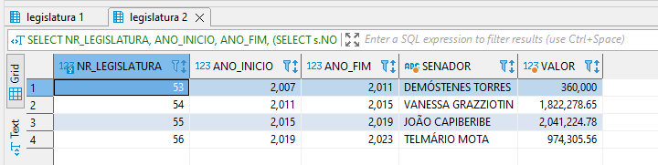

O insight que despertou atenção foi o total da despesa do senador que figura em primeiro lugar na 53a. legislatura; Os seus gastos figuram como a menor despesa dentre todas as legislaturas. Cabe lembrar que o período das legislaturas, a despeito de ser um período longo, não apresentou índices de inflação que de certa forma justificassem o elevado valor gasto com as legislaturas seguintes. Pode ser necessário um levantamento adicional, com a intenção de se obter o perfil destas despesas, com a intenção de tormar mais claro o motivo da discrepância dos gastos.


#### CONSULTA 2 - Quem é o fornecedor que mais recebeu recursos e quais senadores mais contrataram um dado fornecedor.

A segunda consulta, dizem respeito ao fornecedor que mais recebeu recursos e quais senadores contrataram um dado fornecedor.

A primeira delas foi realizada com o uso da função sum() e também com uma junção interna (inner join) com as tabelas de fornecedor, e agrupando os valores de fornecedor, seus nomes e respectivo CNPJ:

```sql
/* consulta 02-a - fornecedores que mais receberam recursos */
select f.ID_FORNECEDOR , f.NOME, f.CPF_CNPJ, sum(d.VALOR_REEMBOLSADO) as VALOR
from fbd.DESPESA d
	inner join fbd.FORNECEDOR f on f.ID_FORNECEDOR = d.ID_FORNECEDOR 
group by f.ID_FORNECEDOR , f.NOME, f.CPF_CNPJ
order by VALOR desc;
```

O resultado da consulta é apresentado a seguir:

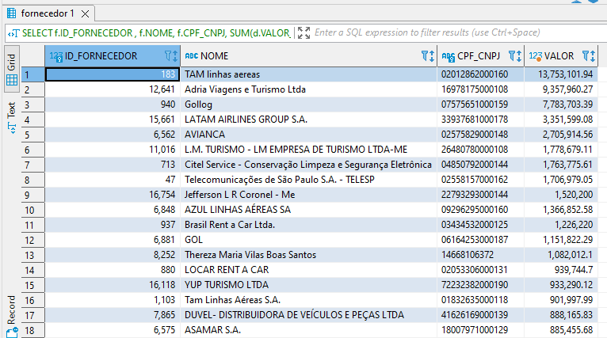

Em relação a estas despesas se observa o maior quantitativo entre empresas aéreas, agências de viagem, de turismo e locadoras; chamou também a atenção uma despesa com gastos de companhias telefônicas.
Outro ponto interessante é o recebimento por parte de uma pessoa fisica, cujo CPF figura como entidade que também recebeu recursos. Com o advento da LGPD, ainda não se sabe se gastos com valores de pessoas físicas irão figurar no futuro de forma tão extensiva e aberta como neste estudo.


A segunda consulta foi realizada para se descobrir quais fornecedores mais contrataram um dado fornecedor. Para tal foi usada a função count() combinando o uso de junções internas entre as tabelas FORNECEDOR e SENADOR:

```sql
/* consulta 02-b - senadores que mais contrataram um dado fornecedor*/
select s.NOME , f.NOME , count(d.ID_FORNECEDOR ) QTD_CONTRATADO 
from fbd.DESPESA d 
	inner join fbd.SENADOR s ON s.ID_SENADOR = d.ID_SENADOR
	inner join fbd.FORNECEDOR f ON f.ID_FORNECEDOR = d.ID_FORNECEDOR 
where d.ID_FORNECEDOR is not null  
group by d.ID_SENADOR , d.ID_FORNECEDOR
order by QTD_CONTRATADO desc;
```

O resultado da consulta é apresentado a seguir:

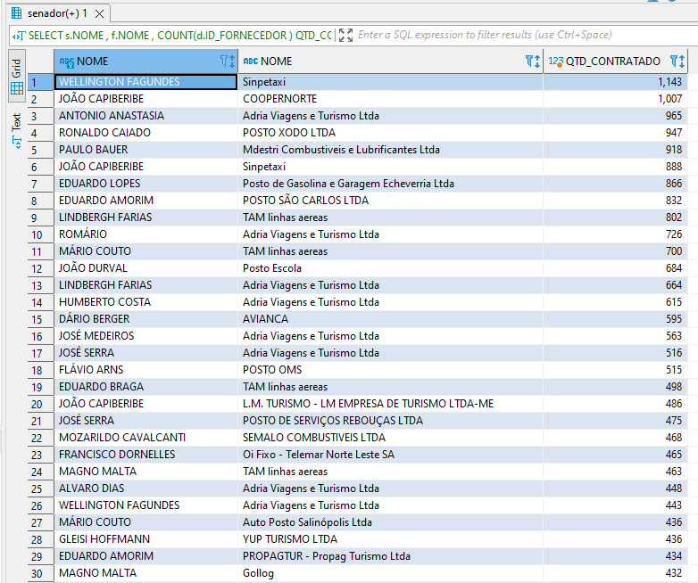

Para o caso desta consulta, chama a atenção de fornecedores semelhantes e com grande número de contratos, bem como senadores com uma quantidade elevada de contratos com fornecedores. Como perfil das empresas, se revelam revendas de combustíveis (postos), empresas de turismo e companhias aéreas.


#### CONSULTA 3 - Para um mesmo tipo de despesa e um mesmo fornecedor, verificar se há divergências nos preços cobrados entre os senadores.

Esta consulta foi criada para verificar se um mesmo fornecedor cobrou valores significativamente diferentes de senadores diferentes para um mesmo serviço. Foi identificado, assim, quem eram os fornecedores de cada despesa realizada pelos senadores. Um senador pode realizar o mesmo tipo de despesa várias vezes no ano e em vários anos. As despesas foram agrupadas, assim, pelos tipos de despesa já apresentados quando discutiu-se a view, pelo fornecedor e por senador. 

Em cada registro, então calculou-se o valor total do tipo de despesa. Po exemplo, se um aluguel foi pago por um dois anos, o total gasto nesses vinte e quatro meses foi somado. Para fins de comparação, manteve-se o número de parcelas pagas no resultado, bem como o valor médio pago. A intenção era comparar despesas equivalentes, que foram pagas pelo mesmo tempo. A comparação seria prejudicada se, de um lado, tivesse o pagamento de um mês de aluguel de um senador e, no outro senador, o pagamento de dozes meses de aluguel.

Organizou-se a consulta para apresentar o fornecedor, o tipo de despesa, o primeiro senador e os valores médio e total pagos por ele e, em seguida, o segundo senador e o valor médio e total por ele. Disponibilizou-se duas colunas no final para deixar mais evidente quais senadores estavam sendo comparados na consulta.

A consulta foi criada a partir de duas consultas que foram operadas para apresentarem a interseção dos resultados. Como o MYSQL não possui o operador "intersect", foi necessário realizar uma operação de junção sobre o resultado das duas primeiras consultas. Nesta junção, projetou-se apenas os dados relevantes para a apresentação final dos resultados. 

As duas primeiras consultas consistem no levantamento das informações gastas de cada senador. Uma delas traz informação do primeiro senador e a outra traz a informação do segundo senador. Cada consulta faz o agrupamento dos valores por fornecedor e por tipo de despesa e traz informações de identificação dos objetos, que serão passados para a consulta maior realizar a junção corretamente. Na consulta principal, é feita uma seleção para trazer apenas os resultados em que um gasto seja pelo menos dez vezes maior que o gasto do outro senador. Um gasto agrupado de um senador é comparado com o de todos os outros senadores para fins de encontrar diferenças significativas.

Um efeito colateral de se montar a consulta por meio de junção em vez de interseção é que a comparação entre dois senadores ocorre tanto do primeiro para o segundo quanto em ordem inversa, com os mesmos dados de valores da ordem direta. Entende-se que seria possível que isso não ocorresse se os dados da consulta fossem tratados por uma procedure e depois armazenados em uma tabela que verifica se o registro já tivesse sido inserido em ordem inversa. Isso, contudo, não afeta a consistência dos dados nem o objetivo da consulta, motivo pelo qual se optou por manter a consulta como está.

O código da consulta pode ser visto abaixo.

```sql
/* Realiza o inner join para criar uma tabela com os dados de senadores 
   de um lado e dados de senadores do outro, 
   desde que o fornecedor seja o mesmo, o tipo de despesa seja a mesma e os 
   valores sejam diferentes em ordem de 10 */
select u1.fornecedor as fornecedor, u1.despesa, 
       s1.nome as senador1, u1.valor_medio as valor_medio_senador1, 
       u1.valor_total as valor_total_senador1, 
       u1.nr_parcelas as nr_parcelas_senador1,
       s2.nome as senador2, u2.valor_medio as valor_medio_senador2, 
       u2.valor_total as valor_total_senador2, 
       u2.nr_parcelas as nr_parcelas_senador2,
       concat(s1.nome, " - ", s2.nome) as relacao_senadores, 
       concat(s2.nome, " - ", s1.nome) as relacao_senadores_inversa
from (
    /* seleciona primeiro grupo com informações de fornecedor, 
       tipo de despesa e valor */
    select f.id_fornecedor, f.NOME as fornecedor, td.ID_TIPO_DESPESA, 
	   td.DESCRICAO as despesa, s.ID_SENADOR , s.NOME as senador,
           round((sum(d.VALOR_REEMBOLSADO) / count(d.MES)),2) as valor_medio, 
	   sum(d.VALOR_REEMBOLSADO) as valor_total, count(d.mes) as nr_parcelas 
        from fbd.tipo_despesa td, fbd.despesa d, fbd.fornecedor f, fbd.senador s 
        where td.ID_TIPO_DESPESA = d.ID_TIPO_DESPESA and 
	      d.ID_FORNECEDOR = f.ID_FORNECEDOR and 
	      d.ID_SENADOR = s.ID_SENADOR 
        group by td.ID_TIPO_DESPESA, f.ID_FORNECEDOR, s.ID_SENADOR) u1, 
     (
    /* seleciona segundo grupo com informações de fornecedor, 
        tipo de despesa e valor */
    select f.id_fornecedor, f.NOME as fornecedor, td.ID_TIPO_DESPESA, 
	   td.DESCRICAO as despesa, s.ID_SENADOR , s.NOME as senador, 
	   round((sum(d.VALOR_REEMBOLSADO) / count(d.MES)),2) as valor_medio, 
	   sum(d.VALOR_REEMBOLSADO) as valor_total, count(d.mes) as nr_parcelas
        from fbd.tipo_despesa td, fbd.despesa d, fbd.fornecedor f, fbd.senador s
        where td.ID_TIPO_DESPESA = d.ID_TIPO_DESPESA and 
	      d.ID_FORNECEDOR = f.ID_FORNECEDOR and 
	      d.ID_SENADOR = s.ID_SENADOR
        group by td.ID_TIPO_DESPESA, f.ID_FORNECEDOR, s.ID_SENADOR) u2, 
    fbd.senador s1, fbd.senador s2
/* Codições do SQL externo para fazer a junção entre as consultas de senadores. 
   Optou-se por comparar os senadores em uma linha para facilitar o 
   entendimento e o encontro das discrepâncias de valores pagos a um mesmo 
   fornecedor em um mesmo tipo de despesa. 
   Com isso, a seleção externa compara os valores de de id_senador 
   diferente em cada tabela. */    
where u1.id_fornecedor = u2.id_fornecedor and 
      u1.id_tipo_despesa = u2.id_tipo_despesa and 
      u1.id_senador != u2.id_senador and u1.id_senador = s1.ID_SENADOR and 
      u2.id_senador = s2.id_senador and u1.nr_parcelas = u2.nr_parcelas and
      ((u1.valor_medio > (u2.valor_medio*10)) OR 
      (u2.valor_medio > (u1.valor_medio*10)))
```

O resultado da consulta 3 pode ser visto abaixo.

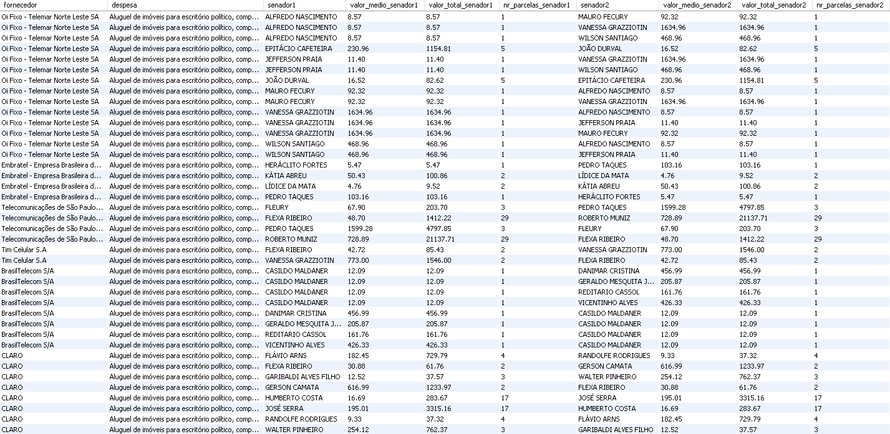

Foi possível observar os seguintes insights a partir do resultado da consulta:

- Existem despesas distintas que são agrupadas em um mesmo tipo de despesa. Essas despesas possuem ordens de grandeza muito diferentes e, idealmente, deveriam ser mantidas como tipos diferentes. Por exemplo, tanto o pagamento do aluguel de um imóvel e quanto o pagamento de um serviço de internet e telefone para o mesmo imóvel são organizados no mesmo tipo de despesa "Aluguel de imóveis para escritório político, compreendendo despesas concernentes a eles.".
- As despesas variáveis, que variam conforme a atividade parlamentar, como serviço de telefone ou gastos com gasolina, possuem grandes diferenças de gastos entre os senadores. Enquanto o senador "Jefferson Praia" gastou R$ 11,40 com a fornecedora "Oi Fixo - Telemar Norte Leste SA", a senadora "VANESSA GRAZZIOTIN" gastou R$ 1.634,96 na mesma legislatura e em um mês. Do mesmo modo, o senador "Fernando Collor" gastou R$ 16.168,60 em quinze parcelas para "MINUTA RECEPÇOES E SERVIÇOS DE BUFFET LTDA" a título de "Locomoção, hospedagem, alimentação, combustíveis e lubrificantes", enquanto que, no mesmo período e para o mesmo fornecedor, a senadora "Marta Suplicy" gastou R$ 882,00.
- Em praticamente todos os tipos de despesa foi possível observar grandes variações de valores pagos pelos senadores para o mesmo fornecedor e mesmo número de parcelas;
- Foram encontrados valores em que a variação entre o valor pago por dois senadores passa de cem vezes. Alguns casos interessantes são: 
    -  "AUTO POSTO JANE" em dois pagamentos, a título de "Locomoção, hospedagem, alimentação, combustíveis e lubrificantes": senador "VALDIR RAUPP" pagou R$ 20.557,50 enquanto o senador "IVO CASSOL" pagou R$ 154,04.
    -  "Papelaria Globo" em um pagamento, a título de "Aquisição de material de consumo para uso no escritório político, inclusive aquisição ou locação de software, despesas postais, aquisição de publicações, locação de móveis e de equipamentos": senador "SÉRGIO PETECÃO" pagou R$ 12.673,00 enquanto o senador "GERALDO MESQUITA JÚNIOR" pagou R$ 30,60.


As variações mais significativas foram apresentadas nos gráficos abaixos.


- Tipo de despesa "Aquisição de material de consumo para uso no escritório político, inclusive aquisição ou locação de software, despesas postais, aquisição de publicações, locação de móveis e de equipamentos":


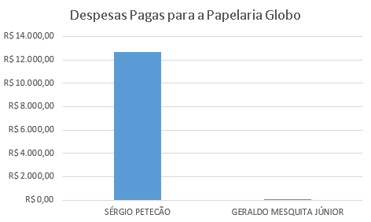

 
- Tipo de despesa "Locomoção, hospedagem, alimentação, combustíveis e lubrificantes":


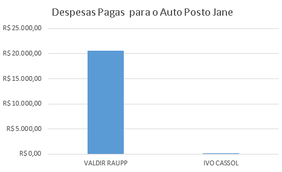


#### CONSULTA 4 - Quantidade média de gastos por senador e por partido.

Para a quarta consulta quis se obter as médias de gastos por senadores e por partidos. Nos dois casos figurou o uso da função avg() seguida do uso de junções, agrupamento (group by) e classificação descendente (order by, desc). Para o primeiro caso, segue o código da consulta:

```sql
/* Consulta 04a - Quantidade média de gastos por senador */
select
	s.NOME , avg(d.VALOR_REEMBOLSADO) as MEDIA_GASTO
from fbd.DESPESA d
	inner join SENADOR s on s.ID_SENADOR = d.ID_SENADOR 
group by s.NOME
order by MEDIA_GASTO desc;
```

O resultado da consulta é apresentado a seguir:

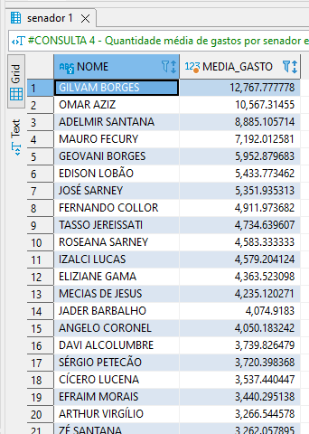

Como insight desta consulta, os primeiros vinte colocados apresentam uma média de despesas acima de R$3.000,00 (três mil Reais), com o primeiro da lista com gastos médios de R$12.000,00 (doze mil Reais).

A outra consulta deste ponto teve o mesmo critério (média de despesas), mas tendo o partido como ponto de agrupamento

```sql
/* Consulta 04b - Quantidade média de gastos por partido */
select m.PARTIDO , avg(d.VALOR_REEMBOLSADO) 
from fbd.MANDATO m
	inner join SENADOR s on s.ID_SENADOR  = m.ID_MANDATO 
	inner join DESPESA d on d.ID_SENADOR = m.ID_SENADOR 
group by m.PARTIDO 	
order by m.PARTIDO;
```

A seguir o resultado da consulta:

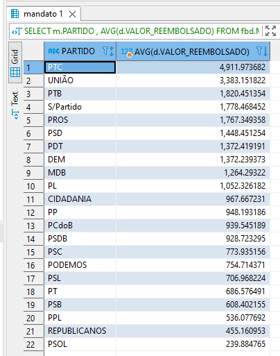

O que se pode observar destes resultados é que os valores máximos são menores, quando comparados com os gastos por senador.


#### CONSULTA 5 - Evolução de percentual de parlamentares de cada gênero por legislatura.

A última consulta visa obter a evolução da participação de senadores do sexo feminino ao longo das legislaturas. Para isto foi usada a função concat() combinada com o uso de count() para a variável sexo na tabela SENADOR. a divisão dos resultados destas funções resultou no percentual dos parlamentares por sexo, para cada legislatura:

```sql
/* Consulta 05 - Evolução de percentual de parlamentares */ 
/*               de cada gênero por legislatura.         */
select 
	ml.NR_LEGISLATURA , concat(l.ANO_INICIO, " - ", l.ANO_FIM) 
	as LEGISLATURA , 
	s.SEXO, count(ml.NR_LEGISLATURA) as TOTAL_POR_SEXO, 
	(count(ml.NR_LEGISLATURA) / (
		select  count(s_s.SEXO)
		from fbd.MANDATO_LEGISLATURA s_ml 
			inner join fbd.MANDATO s_m 
			  on s_m.ID_MANDATO = s_ml.ID_MANDATO
			inner join fbd.SENADOR s_s 
			  on s_s.ID_SENADOR  = s_m.ID_SENADOR 
		where s_m.LEGISLATURA = ml.NR_LEGISLATURA
	)) * 100  as PORCENTAGEM
# CONSULTA 5 - CONTINUACAO	
from fbd.MANDATO_LEGISLATURA ml
	inner join fbd.LEGISLATURA l 
	  on l.NR_LEGISLATURA = ml.NR_LEGISLATURA 
	inner join fbd.MANDATO m 
	  on m.ID_MANDATO = ml.ID_MANDATO
	inner join fbd.SENADOR s 
	  on s.ID_SENADOR  = m.ID_SENADOR 
group by s.SEXO, l.NR_LEGISLATURA 	
order by l.NR_LEGISLATURA;
```

A seguir o resultado da consulta:

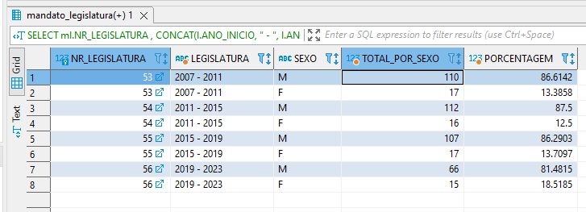

Com o resultado desta consulta, a 53a. legislatura tinha um percentual de 13,39 por cento de mulheres, e na última legislatura este valor aumentou para 18,52%, traduzindo-se um aumento de 5,13 pontos percentuais. Pode se notar também a tendência de aumento ao longo das legislaturas, com exceção de uma queda na 54a. legislatura, quando a participação das mulheres na casa legislativa foi de 12,50% dos mandatos. Observa-se ainda Um aumento de 4,82% para a atual legislatura quando comparada com a anterior.

Outra curiosidade diz respeito ao momento de construção desta consulta: em um dado momento constatou-se que o número de senadores é sempre maior que 81, diferente do número de mandatos; Isto se deve ao fato dos suplentes assumirem os mandatos em casos de cassação, renúncia, licenciamento ou morte dos senadores titulares do mandato.


## Conclusão

Este trabalho se propôs a utilizar tecnologias de Sistemas Gerenciadores de Banco de Dados (SGBD), do tipo relacional, para analisar o uso das cotas para atividade parlamentar dos integrantes do Senado Federal (senadores). Por meio da utilzação de SGBD e ferramentas como MySQL e DBeaver, permitiu, com o uso de bases de dados abertos da referida casa legislativa, uma análise do perfil de gastos da cota para exercício da atividade parlamentar - CEAP. Os dados foram coletados, tratados e armazenados no SGBD MySQL. Para as consultas e gerenciamento geral da base foi utilizado o software DBeaver e MySQL Workbench. Os gastos compreendem as legislaturas de número 53 a 56, nos anos de 2007 a 2020.

Durante a atividade de coleta e tratamento de dados, dentre as principais dificuldades encontradas destaca-se  a ausência de alguns dados para complementar a carga das tabelas, tendo sido necessário fazer uma coleta manual nas páginas html. Também foi preciso limitar as legislaturas, por motivos de diferenças de padronização nos dados disponíveis. Outro desafio diz respeito a falta de prática com as ferramentas (MysQL, Workbench e Dbeaver), bem como os conhecimentos de álgebra relacional por parte dos integrantes.

Através da elaboração de uma view e de consultas complementares, os dados tratados forneceram um perfil de gastos da atividade parlamentar, tendo as despesas com transportes se apresentando como a maior categoria em volume de gastos. Por sua vez, fornecedores como companhias aéreas, agências de turismo e locadoras se apresentam como os que mais receberam recursos.

Como sugestão de estudos futuros, pode-se propor a construção de consultas mais elaboradas e complexas, bem como a ampliação da base de dados compreendento um período maior, com mais legislaturas.

## Referências

BRASIL. Conselho de Transparência. Senado Federal. Dados Abertos - CEAPS: transparência. Transparência. 2022. Conselho de Transparência e Controle Social. Disponível em: https://www12.senado.leg.br/transparencia/dados-abertos-transparencia/dados-abertos-ceaps. Acesso em: 06 jul. 2022.

BRASIL. Senado Federal. Primeira Secretaria do Senado. APS 5/2014: instruções sobre reembolso da cota para o exercício da atividade parlamentar - ceap. Instruções sobre reembolso da Cota para o Exercício da Atividade Parlamentar - CEAP. 2014. Atos Normativos. Disponível em: https://adm.senado.leg.br/normas/ui/pub/normaConsultada?idNorma=203003. Acesso em: 9 jul. 2022.


