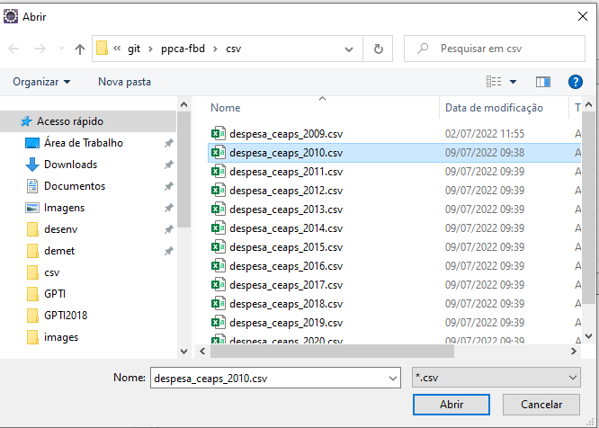
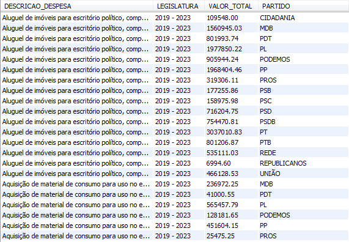

# ppca-fbd
Código da Disciplina Fundamentos de Bancos de Dados

## Arquitetura

O código do trabalho é feito usando como SGBD MySQL. Para utilizá-lo, vamos usar uma imagem Docker que já roda o banco de dados.

Após isso, faremos a importação dos dados das Cotas Parlamentares dos Senadores. Os dados abertos estão em https://www12.senado.leg.br/transparencia/dados-abertos-transparencia/dados-abertos-ceaps, item Cotas para Exercício da Atividade Parlamentar dos Senadores (CEAPS). Esses dados serão importados para uma tabela única, e normalizados em tabelas específicas depois.

Utilizaremos como ferramenta de interação com o banco de dados o DBeaver 

## Montagem do ambiente

- Instale o Docker com o Docker Compose(https://docs.docker.com/compose/install/)
- Rode o seguinte comando no local onde está o arquivo docker-compose.yml para subir o banco de dados: `docker-compose up`. Ele vai criar um banco de dados com as seguintes características:
 - Server host: localhost
 - Port: 3306
 - Database: fbd
 - Username: root
 - Password: fbd
- Instale o DBeaver (https://dbeaver.io/download/)

### Configuração do DBeaver

Pra acessar com mais facilidade o banco de dados e permitir uma importação com facilidade, é necessário configurar uma conexão com o DBeaver. Ela será feita conforme o roteiro abaixo:

1. Na aba Navegador de Banco de Dados, clique com o botão direito e selecione Criar -> Connection:


2. Selecione, na lista de SGBDs, o driver do MySQL. Se ele não estiver na máquina, ele vai baixar:


3. Configure a conexão com as credenciais do banco criado pelo Docker (se usar uma instalação própria, use as credenciais definidas lá):


4. Modifique a conexão para que a opção Allow Public Key seja setada para `true`. Isso evita o erro de conexão que acontece quando o MySQL tenta recuperar uma chave pública para a conexão:


5. Salve a conexão. 

## Importação dos dados

Para dar a carga dos dados recuperados do site da Transparência no nosso banco de dados, precisaremos fazer a preparação dos dados dos arquivos e a importação no SGBD. Veremos todos os passos a seguir.

### Criação das tabelas do banco de dados

Vamos criar os objetos de banco necessários para que possamos receber os dados e tratá-los para obter as informações que queremos. O script de criação dos dados está em `fbd_scripts/fbd-tables.sql`, e vai gerar o banco de dados da figura abaixo:


Para rodar o script, faça o seguinte roteiro:

- No DBeaver, clique com o botão direito em cima do banco `fbd` e abra um Editor SQL:


- Rode o script mencionado acima. Ele criará toda a estrutura apresentada no modelo.

Além de criar a estrutura de tabelas, o script também carrega a tabela  _Legislatura_ , que já tem valores conhecidos para o nosso problema.

### Dados brutos de despesa

#### Tratamento dos arquivos

- Baixar os dados do [site](https://www12.senado.leg.br/transparencia/dados-abertos-transparencia/dados-abertos-ceaps). Utilizaremos o período de 2009 a 2021, por estarem mais completos e íntegros
- Abra os arquivos `csv` e retire a primeira linha. Ela tem o seguinte formato: `"ULTIMA ATUALIZACAO";"06/08/2021 02:00"`

#### Importação dos dados para o SGBD

- No Navegador de banco de dados, clique com o botão direito na tabela CARGA_DESPESA, e selecione Importar dados


- Escolha a fonte de dados (CSV)


- O programa vai abrir uma janela para a escolha do arquivo. Selecione o arquivo que deseja importar:



- Informe as propriedades da importação:


Note que as seguintes propriedades são específicas para o nosso caso:
  * Encoding (Traduzido de forma errada para Encodificando): ISO-8859-1
  * Delimitador de coluna: `;`. Os dados não são separados por vírgula na fonte, e sim, por ponto-e-vírgula
  * Definir Strings vazias para NULL: `true`. Dessa forma as colunas ficarão nulas, e não com string vazias
  * Formato Date/Time: `dd/MM/yyyy`, para que as datas sejam importadas no formato correto


- Mapeie as colunas do CSV com as colunas da tabela. Atenção para a coluna `DATA`, que deve ser mapeada para `DATA_REEMBOLSO`


- Avance no Wizard até o resumo, e confira as especificações que foram definidas:


- Conclua o procedimento, e os dados serão carregados na tabela CARGA_DESPESA

### Dados dos Senadores

O portal do Senado não possui um arquivo pronto com os dados dos Senadores das legislaturas anteriores. Sendo assim, será necessário recuperar esses dados através dos dados que estão nas páginas HTML e formatá-los como CSVs para importação no banco.

#### Tratamento dos arquivos

- Entre no endereço que contém as [legislaturas](https://www25.senado.leg.br/web/senadores/legislaturas-anteriores) do Senado Federal
- Escolha a legislatura que será importada. No caso em tela, faremos isso para as legislaturas de 53 a 55
- Em  _Organizar por_ , selecione a opção  _Sexo_ 
- Selecione os nomes na tela e copie as informações
- Abra um editor de planilhas da sua preferência e cole as informações nele
- Acrescente duas colunas à direita dos dados: `Sexo` e `Legislatura`
- Preencha o valor da coluna `Sexo` de acordo com o o grupo
- Preencha o valor da coluna `Legislatura` com o número da legislatura pesquisada
- Apague as linhas que contém os valores Masculino e Feminino
- Repita o procedimento para cada legislatura
- Ao terminar de importar os dados das legislaturas anteriores, vá até o endereço da (legislatura atual)[https://www25.senado.leg.br/web/senadores/em-exercicio/-/e/por-sexo]
- Faça o mesmo tratamento que foi feito para as legislaturas anteriores
- Retire os caracteres `  *` (dois espaços em branco e um asterisco) da massa de dados. Esse sinal gráfico é pra representar os suplentes que entraram em exercício, e podem impedir que os senadores sejam identificados corretamente. 

#### Importação dos dados para o SGBD

Assim como foi feito para os dados de despesa, os dados de Senadores também devem ser importados utilizando o DBeaver. Repita os passos que foram feitos para a tabela `CARGA_DESPESA`, tendo o cuidado de mapear as colunas do CSV corretamente. 

Há, porém, uma diferença. A tabela `CARGA_SENADOR` possui uma  _trigger_ que vai disparar a cada registro, populando as tabelas `SENADOR`, `MANDATO` e `MANDATO_LEGISLATURA`. A lógica desse gatilho vai se explicada mais à frente.

### Processo de ETL das despesas

Uma vez que os dados brutos já estão cadastrados na base, faremos o processo de normalização dos dados de despesa dentro do nosso modelo. O objeto responsável por fazer essa transformação é a procedure `PRC_ETL_DESPESA`. 

## MANIPULAÇÃO DE DADOS

### PROCEDURE

- Despesas (Jubé)
  - Carga a partir de CSV.  
  - Realizar a transformação dos dados extraídos (separar mandato e legislatura no arquivo de depesas).
  - Realizar a carga inicial das informações extraídas por meio do CSV.
  - A cada chamada, ler toda a tabela e tratar os dados novos.

### TRIGGER 

Uma "trigger" é um objeto de banco de dados ativado quando ocorre algum evento em determinada tabela. Esse eventos podem ser operações como "inserts", "updats" ou "deletes" na tabela em que a "trigger" está vinculada. É possível ativar a trigger tanto antes da operação ocorrer como depois. 

As triggers requerem tabelas físicas para serem ativadas. Triggers não são permitidas em tabelas virtuais como views. Apesar disso, é possível que a trigger seja ativada, se a view for atualizável, no momento em que a a tabela física que esteja associadas à consulta da view for atualizada. Além disso, triggers são ativadas apenas por comandos SQL. Não é possível ativar a trigger com uso de APIs relacionadas à bancos de dados distribuídos. Triggers também não podem ser usadas em tabelas de sistema, como os esquemas "INFORMATION_SCHEMA" e "performance_schema".  

As triggers conseguem disponibilizar os dados do registro, tanto o dado antigo a ser atualizado quanto o dado do novo registro. A trigger oferece a opção "old" para acessar o dado antigo do registro, e a opção "new" para o dado novo. Para usar, basta associar a opção ao campo, no formato old.campo ou new.campo.

Triggers podem ser usadas para validar campos, calcular informações, gravar registros de auditorias, entre outros vários usos. A trigger deste trabalho foi utilizada para realizar o tratamento dos dados recebidos pela carga de senadores provenientes do arquivo CSV. Como visto na etapa de ETL, os dados obtidos da página de dados abertos foram inseridos em "carga_senador". A cada registro inserido, após a inserção, a trigger TRG_CARGA_SENADOR, vinculada a essa tabela, é ativada. 

A tabela "carga_senador" pode ser vista abaixo:


A trigger segue a seguinte lógica: 

- Primero, ela verifica se já existe um senador, na tabela "senador", com aquele nome recebido do CSV, e armazena o identificador em uma variável;
- Caso o senador não exista, ele é inserido na tabela "senador" e depois é feito um "select" para manter o identificador em uma variável;
- Em seguida, é verificado se o mandato recebido pelo CSV existe para aquele servidor. O mandato é mantido por legislatura, então, para cada senador, haverá pelo menos dois registros na tabela mandato;
- É realizada uma operação para selecionar e identificar o identificador do mandato em uma variável;
- Para cada mandato inserido, é necessário fazer o vínculo dele com a legislatura na tabela "MANDATO_LEGISLATURA". Um novo registro é inserido nessa tabela para manter essa informação.

O código da trigger TRG_CARGA_SENADOR é disponibilizado abaixo:

```
CREATE DEFINER=`root`@`localhost` TRIGGER TRG_CARGA_SENADOR
AFTER INSERT
ON carga_senador FOR EACH row
begin
    DECLARE v_id_senador int default 0;
    DECLARE v_id_mandato int default 0;
   
    SELECT s.id_senador INTO v_id_senador 
        FROM fbd.senador s 
        WHERE TRIM(UPPER(s.nome)) = TRIM(UPPER(new.NOME)) COLLATE utf8mb4_0900_ai_ci;    
	
    IF (v_id_senador = 0) then
	INSERT INTO SENADOR (NOME, SEXO) 
	    VALUES (new.NOME, new.SEXO);
	SELECT s.id_senador INTO v_id_senador 
	    FROM fbd.senador s 
	    WHERE TRIM(UPPER(s.nome)) = TRIM(UPPER(new.NOME)) COLLATE utf8mb4_0900_ai_ci;
    end if; 
   
    SELECT m.id_mandato INTO v_id_mandato 
        FROM fbd.mandato m 
	WHERE m.ID_SENADOR = v_id_senador AND m.LEGISLATURA = new.legislatura;
 	
    IF (v_id_mandato = 0) then
    	INSERT INTO MANDATO (ID_SENADOR, ESTADO, PERIODO, LEGISLATURA, PARTIDO) 
	    VALUES (V_ID_SENADOR, new.uf, new.PERIODO, new.LEGISLATURA, new.PARTIDO);
    	SELECT m.id_mandato INTO v_id_mandato 
	    FROM fbd.mandato m 
	    WHERE m.ID_SENADOR = v_id_senador AND m.LEGISLATURA = new.legislatura;
        INSERT INTO MANDATO_LEGISLATURA (ID_MANDATO, NR_LEGISLATURA) 
	    VALUES (v_id_mandato, new.LEGISLATURA);
    end if;
    
 END 
```

Após o tratamento dos dados realizados pela trigger, pode-se verificar o resultado nas tabelas "senador", "mandato" e "mandato_legislatura", conforme abaixo.

- Tabela senador:


- Tabela mandato:


- Tabela mandato_legislatura:


### VIEW

Um requisito do projeto de banco de dados era a criação de uma view. As views são consultas armazenadas que funcionam como uma tabela virtual. Os dados, de fato, não estão presentes na view, mas sim em suas tabelas de origem. A view, assim, é uma consulta e pode trazer dados de várias tabelas e utilizar todas as funções normalmente utilizadas em consultas, como group by, having, sum, count etc.

Uma view pode ser atualizável. Isso significa que ela aceita comandos que permitam a manipulação dos dados, ou seja, receber comandos de "insert", "update" ou "delete". A view recebe o comando e o direciona para a tabela física correspondente. 

Essa capacidade de atualização pode gerar algumas inconsistências. Caso a view inclua condições na cláusula "where", pode ocorrer a situação em que um "insert" na view não representa a inclusão de um registro na view. Isso ocorre se o registro inserido não fizer parte da seleção ("where") realizada para formar a consulta. 

Existe uma cláusula importante no tratamento de views, chamada de "with check option". Essa opção, ao ser inserida na view, realiza um controle sobre o registro a ser manipulado, relacionado à capacidade do registro participar ou não da seleção da view. Caso o registro seja retornável pela consulta da view, o SGBD impede a manipulação do registro, ou seja, ele não permite a inserção, a alteração ou a exclusão do registro.

A opção "with check option" só se aplica a views que forem atualizáveis. O SGBD não permite seu uso com views não atualizáveis.

Uma view será não atualizável se não houver correspondência de um para um entre um registro da tabela física e um registro da view. Algumas cláusulas de consulta também tornam a view não atualizável. O MYSQL elenca as seguintes condições para uma view ser não atualizável:

- Funções de agregação (SUM(), MIN(), MAX(), COUNT() etc)
- DISTINCT
- GROUP BY
- HAVING
- UNION / UNION ALL
- Uso de subconsulta (subquery)
- Subconsultas não dependentes tem algumas restrições
- Alguns joins
- Referência à visão não atualizável na cláusula FROM
- Subconsulta na cláusula WHERE que se refere a uma tabela na cláusula FROM
- Não possui tabelas na consulta para atualizar
- Uso de uma tabela temporária
- Várias referências a qualquer coluna de uma tabela base 

A view escolhida tem por objetivo identificar quais são os maiores tipos de despesas por legislatura e por partido. Vale ressaltar que uma legislatura é um período de quatro anos. A partir desse objetivos, a seguinte consulta foi materializada:

```
CREATE OR REPLACE VIEW fbd.VW_DESPESA_POR_LEGISLATURA AS
SELECT td.id_tipo_despesa, TD.DESCRICAO AS DESCRICAO_DESPESA, 
       CONCAT(L.ANO_INICIO, " - ", L.ANO_FIM) AS LEGISLATURA, 
       SUM(D.VALOR_REEMBOLSADO) AS VALOR_TOTAL, m.PARTIDO 
FROM fbd.TIPO_DESPESA TD, fbd.DESPESA D, fbd.MANDATO M, 
     fbd.LEGISLATURA L, fbd.MANDATO_LEGISLATURA ML   
WHERE TD.ID_TIPO_DESPESA = D.ID_TIPO_DESPESA AND 
      D.ID_SENADOR = M.ID_SENADOR  AND
      M.ID_MANDATO = ML.ID_MANDATO AND 
      M.LEGISLATURA = ML.NR_LEGISLATURA AND 
      ML.NR_LEGISLATURA = L.NR_LEGISLATURA # AND 
GROUP BY TD.ID_TIPO_DESPESA, ML.NR_LEGISLATURA, m.PARTIDO 
ORDER BY legislatura DESC, td.descricao, m.partido asc;
```

Como se pode observar, essa consulta possui vários elementos que não permitem que essa view seja atualizável. Dentre eles, vê-se o uso de cláusulas group by e que não existe correspondência de um-para-um com uma tabela física. A saída dessa consulta por ser vista abaixo, com a apresentação dos seus primeiros registros:



A partir disso, foi possível obter uma visão gráfica sobre o tipo de despesa mais utilizado por cada partido no período de 2019 a 2020 (legislatura de 2019 a 2023). 


Nesse gráfico, fica fácil observar que, no período indicado, os tipos de despesa mais consumidos são, da ordem do maior para o menor:

- Passagens aéreas, aquáticas e terrestres nacionais;
- Contratação de consultorias, assessorias, pesquisas, trabalhos técnicos e outros serviços de apoio ao exercício do mandato parlamentar;
- Locomoção, hospedagem, alimentação, combustíveis e lubrificantes;
- Aluguel de imóveis para escritório político, compreendendo despesas concernentes a eles;
- Divulgação da atividade parlamentar;
- Aquisição de material de consumo para uso no escritório político, inclusive aquisição ou locação de software, despesas postais, aquisição de publicações, locação de móveis e de equipamentos;
- Serviços de Segurança Privada.

### CONSULTAS

#### CONSULTA 1 - Quais senadores mais gastaram em cada legislatura. (Marcos) 


#### CONSULTA 2 - Quem é o fornecedor que mais ganhou dinheiro e quais senadores mais contrataram um dado fornecedor. (Marcos)


#### CONSULTA 3 - Para um mesmo tipo de despesa e um mesmo fornedor, verificar se há divergências nos preços cobrados entre os senadores.

Esta consulta foi criada para verificar se um mesmo fornecedor cobrou valores significativamente diferentes de senadores diferentes para um mesmo serviço. Foi identificado, assim, quem eram os fornecedores de cada despesa realizada pelos senadores. Um senador pode realizar o mesmo tipo de despesa várias vezes no ano e em vários anos. As despesas foram agrupadas, assim, pelos tipos de despesa já apresentados quando discutiu-se a view, pelo fornecedor e por senador. 

Em cada registro, então calculou-se o valor total do tipo de despesa. Po exemplo, se um aluguel foi pago por um dois anos, o total gasto nesses vinte e quatro meses foi somado. Para fins de comparação, manteve-se o número de parcelas pagas no resultado, bem como o valor médio pago. A intenção era comparar despesas equivalentes, que foram pagas pelo mesmo tempo. A comparação seria prejudicada se, de um lado, tivesse o pagamento de um mês de aluguel de um senador e, no outro senador, o pagamento de dozes meses de aluguel.

Organizou-se a consulta para apresentar o fornecedor, o tipo de despesa, o primeiro senador e os valores médio e total pagos por ele e, em seguida, o segundo senador e o valor médio e total por ele. Disponibilizou-se duas colunas no final para deixar mais evidente quais senadores estavam sendo comparados na consulta.

A consulta foi criada a partir de duas consultas que foram operadas para apresentarem a interseção dos resultados. Como o MYSQL não possui o operador "intersect", foi necessário realizar uma operação de junção sobre o resultado das duas primeiras consultas. Nesta junção, projetou-se apenas os dados relevantes para a apresentação final dos resultados. 

As duas primeiras consultas consistem no levantamento das informações gastas de cada senador. Uma delas traz informação do primeiro senador e a outra traz a informação do segundo senador. Cada consulta faz o agrupamento dos valores por fornecedor e por tipo de despesa e traz informações de identificação dos objetos, que serão passados para a consulta maior realizar a junção corretamente. Na consulta principal, é feita uma seleção para trazer apenas os resultados em que um gasto seja pelo menos dez vezes maior 

```
select u1.fornecedor as fornecedor, u1.despesa, 
       s1.nome as senador1, u1.valor_medio as valor_medio_senador1, 
       u1.valor_total as valor_total_senador1, u1.nr_parcelas as nr_parcelas_senador1,
       s2.nome as senador2, u2.valor_medio as valor_medio_senador2, 
       u2.valor_total as valor_total_senador2, u2.nr_parcelas as nr_parcelas_senador2,
       concat(s1.nome, " - ", s2.nome) as relacao_senadores, 
       concat(s2.nome, " - ", s1.nome) as relacao_senadores_inversa
from (
    select f.id_fornecedor, f.NOME as fornecedor, td.ID_TIPO_DESPESA, 
	   td.DESCRICAO as despesa, s.ID_SENADOR , s.NOME as senador,
           round((sum(d.VALOR_REEMBOLSADO) / count(d.MES)),2) as valor_medio, 
	   sum(d.VALOR_REEMBOLSADO) as valor_total, count(d.mes) as nr_parcelas 
        from fbd.tipo_despesa td, fbd.despesa d, fbd.fornecedor f, fbd.senador s 
        where td.ID_TIPO_DESPESA = d.ID_TIPO_DESPESA and d.ID_FORNECEDOR = f.ID_FORNECEDOR and 
	      d.ID_SENADOR = s.ID_SENADOR 
        group by td.ID_TIPO_DESPESA, f.ID_FORNECEDOR, s.ID_SENADOR) u1, 
     (
    select f.id_fornecedor, f.NOME as fornecedor, td.ID_TIPO_DESPESA, 
	   td.DESCRICAO as despesa, s.ID_SENADOR , s.NOME as senador, 
	   round((sum(d.VALOR_REEMBOLSADO) / count(d.MES)),2) as valor_medio, 
	   sum(d.VALOR_REEMBOLSADO) as valor_total, count(d.mes) as nr_parcelas
        from fbd.tipo_despesa td, fbd.despesa d, fbd.fornecedor f, fbd.senador s
        where td.ID_TIPO_DESPESA = d.ID_TIPO_DESPESA and d.ID_FORNECEDOR = f.ID_FORNECEDOR and 
	      d.ID_SENADOR = s.ID_SENADOR
        group by td.ID_TIPO_DESPESA, f.ID_FORNECEDOR, s.ID_SENADOR) u2, 
    fbd.senador s1, fbd.senador s2
where u1.id_fornecedor = u2.id_fornecedor and u1.id_tipo_despesa = u2.id_tipo_despesa and 
      u1.id_senador != u2.id_senador and u1.id_senador = s1.ID_SENADOR and 
      u2.id_senador = s2.id_senador and u1.nr_parcelas = u2.nr_parcelas and
      ((u1.valor_medio > (u2.valor_medio*10)) OR (u2.valor_medio > (u1.valor_medio*10)))
```

#### CONSULTA 4 - Quantidade média de gastos por senador e por partido. (Marcos)


#### CONSULTA 5 - Evolução de percentual de parlamentares de cada gênero por legislatura. (Marcos)


